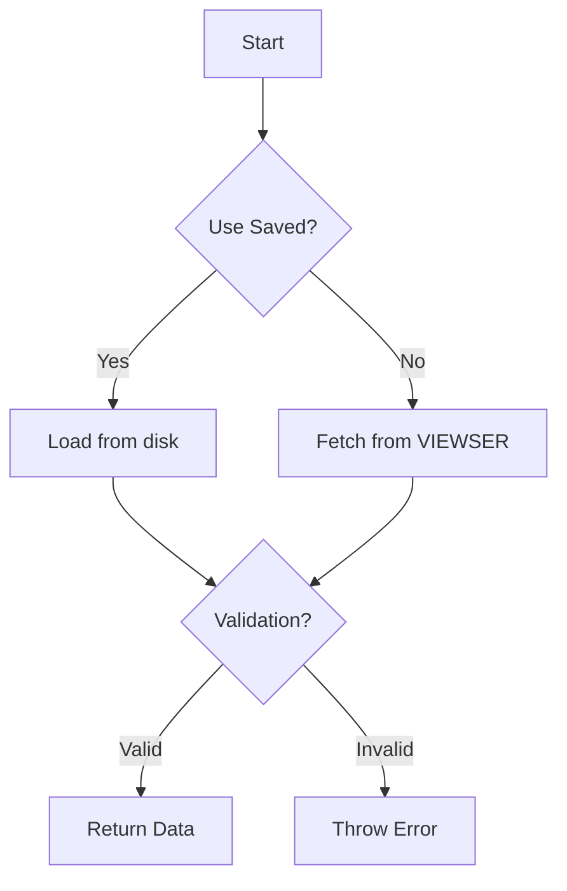

# Table of Contents
- [ViewsDataLoader Class Documentation](#viewsdataloader-class-documentation)
  - [Overview](#overview)
  - [Key Features](#key-features)
  - [Class Structure](#class-structure)
    - [Initialization](#initialization)
    - [Core Methods](#core-methods)
      - [Partition Configuration](#partition-configuration)
      - [Data Fetching](#data-fetching)
      - [Temporal Validation](#temporal-validation)
      - [Main Data Loading](#main-data-loading)
  - [Example Use Cases](#example-use-cases)
    - [Basic Calibration Load](#basic-calibration-load)
    - [Fresh Forecasting Data Fetch](#fresh-forecasting-data-fetch)
    - [Validation with Custom Range](#validation-with-custom-range)
  - [Error Handling](#error-handling)
- [ViewsDataset Class Documentation](#viewsdataset-class-documentation)
  - [Overview](#overview-1)
  - [Class Structure](#class-structure-1)
    - [Initialization](#initialization-1)
    - [Core Functionality](#core-functionality)
      - [Data Conversion](#data-conversion)
      - [Statistical Analysis](#statistical-analysis)
      - [Prediction Handling](#prediction-handling)
      - [Visualization](#visualization)
  - [Example Use Cases](#example-use-cases-1)
    - [Basic Data Loading](#basic-data-loading)
    - [Prediction Analysis](#prediction-analysis)
    - [Custom Subsetting](#custom-subsetting)
  - [Error Handling](#error-handling-1)
  - [Design Rationale](#design-rationale)
    - [Tensor Architecture](#tensor-architecture)
    - [Performance Optimizations](#performance-optimizations)
    - [Statistical Methods](#statistical-methods)
  - [Specialized Subclasses](#specialized-subclasses)
# ViewsDataLoader Class Documentation

## Overview
The `ViewsDataLoader` class handles data loading, validation, and preprocessing for different temporal partitions in a machine learning pipeline. It integrates with VIEWSER data infrastructure, supports partition validation, drift detection, and data persistence features.

## Key Features
- Partition-aware data loading (calibration/validation/forecasting)
- Fresh data fetching vs. cached data loading
- Temporal range validation
- Drift detection integration
- Month override capability
- Data format enforcement

## Class Structure

### Initialization
```python
def __init__(self, model_path: ModelPathManager, **kwargs):
```

| Parameter  | Type              | Description                                      |
|------------|-------------------|--------------------------------------------------|
| model_path | ModelPathManager  | Manages model-specific paths                     |
| **kwargs   | Any               | Additional attributes (partition, override_month, etc.) |

- Initializes paths and configuration:
  - Sets raw/processed data paths from `ModelPathManager`
  - Accepts optional partition configuration through `kwargs`
  - Configures drift detection settings
 
### Core Methods

1. **Partition Configuration**
```python
def _get_partition_dict(self, step=36) -> Dict
```

Defines temporal ranges for different partition types:

| Partition   | Train Range  | Test Range    | Description                      |
|-------------|--------------|---------------|----------------------------------|
| Calibration | (121, 396)   | (397, 444)    | Historical training + validation |
| Validation  | (121, 444)   | (445, 492)    | Extended training + test         |
| Forecasting | (121, N-2)   | (N-1, N+step) | Rolling window forecasting       |

2. **Data Fetching**
```python
def _fetch_data_from_viewser(self, self_test: bool) -> tuple[pd.DataFrame, list]
```
- Fetches data from VIEWSER with drift detection:
  - Retrieves queryset configuration
  - Executes fetch with drift checks
  - Enforces `float64` data types
  - Logs data quality alerts

3. **Temporal Validation**
```python
def _validate_df_partition(self, df: pd.DataFrame) -> bool
```
- Validates DataFrame contains expected months:
  - Checks `month_id` column/index
  - Compares against partition specifications
  - Handles `override_month` for forecasting
 
4. **Main Data Loading**
```python
def get_data(self, self_test: bool, partition: str, 
            use_saved: bool, validate=True, 
            override_month=None) -> tuple[pd.DataFrame, list]
```

**Data loading workflow**:


### Example Use Cases

1. **Basic Calibration Load**
```python
loader = ViewsDataLoader(model_path)
df, alerts = loader.get_data(
    self_test=False,
    partition="calibration",
    use_saved=True
)
```
- Loads pre-cached calibration data
- Skips drift detection
- Automatic temporal validation

2. **Fresh Forecasting Data Fetch**
```python
loader = ViewsDataLoader(model_path, override_month=492)
df, alerts = loader.get_data(
    self_test=True,
    partition="forecasting",
    use_saved=False
)
```
- Fetches fresh data up to month 492
- Performs drift self-test
- Generates new data cache file

3. **Validation with Custom Range**
```pythonloader = ViewsDataLoader(model_path, override_month=500)
df, alerts = loader.get_data(
    self_test=False,
    partition="validation",
    use_saved=False,
    validate=False
)
```
- Overrides default validation range
- Disables automatic validation
- Bypasses data caching

### Error Handling

**The class raises specific exceptions for common failure scenarios**:
| Error Type   | Trigger Condition       | Resolution                              |
|--------------|-------------------------|-----------------------------------------|
| RuntimeError | Missing queryset        | Check model configuration               |
| ValueError   | Invalid partition       | Use calibration/validation/forecasting  |
| RuntimeError | Invalid cached data     | Delete/refresh cache files              |


# ViewsDataset Class Documentation

## Overview

The `ViewsDataset` class provides a unified interface for handling spatiotemporal datasets with support for:
- Tensor conversion (4D: time × entity × samples × variables)
- Probabilistic prediction analysis (MAP, HDI, sampling)
- Statistical summaries and visualizations
- Data validation and integrity checks
- Parallel processing for performance-critical operations

Designed for two primary modes:
1. **Feature Mode**: For model training/evaluation with explicit targets
2. **Prediction Mode**: For storing/analyzing model outputs (`pred_*` columns)

## Class Structure

### Initialization
```python
ViewsDataset(source: Union[pd.DataFrame, str, Path], 
            targets: Optional[List[str]] = None,
            broadcast_features: bool = False)
```

| Parameter           | Type               | Description                                      |
|---------------------|--------------------|--------------------------------------------------|
| source              | DataFrame/Path     | Input data with MultiIndex (time, entity)        |
| targets            | List[str]          | Required for feature mode (dependent variables)  |
| broadcast_features  | bool               | Expand scalar features to match sample size      |

**Index Requirements:**

- Must be pandas MultiIndex with exactly two levels
- Common patterns: `(month_id, country_id)` or `(month_id, priogrid_id)`

### Core Functionality

1. **Data Conversion**

    ```python
    # Convert to 4D tensor (time × entity × samples × vars)
    dataset.to_tensor() -> np.ndarray

    # Convert tensor back to DataFrame
    dataset.to_dataframe(tensor) -> pd.DataFrame
    ```

    **Tensor Structure:**

    ```python
    # Feature Mode
    tensor.shape == (num_times, num_entities, sample_size, num_features)

    # Prediction Mode
    tensor.shape == (num_times, num_entities, num_samples, num_pred_vars)
    ```

2. **Statistical Analysis**

    ```python
    # Calculate Maximum A Posteriori estimates
    dataset.calculate_map() -> pd.DataFrame

    # Compute Highest Density Intervals
    dataset.calculate_hdi(alpha=0.9) -> pd.DataFrame

    # Generate statistical summaries
    dataset.compute_statistics() -> pd.DataFrame
    ```

3. **Prediction Handling**

    ```python
    # Draw random samples from distributions
    dataset.sample_predictions(num_samples=5) -> pd.DataFrame

    # Validate tensor reconstruction
    dataset.check_integrity() -> bool
    ```

4. **Visualization**

    ```python
    # Plot distribution with MAP/HDI
    dataset.plot_map(entity_id=42, var_name="pred_conflict")

    # Interactive HDI visualization
    dataset.plot_hdi(alphas=(0.5, 0.9, 0.95))
    ```

### Example Use Cases

1. **Basic Data Loading**

    ```python
    # Load training data
    train_data = ViewsDataset(
        "data/calibration.feather",
        targets=["ged_sb"],
        broadcast_features=True
    )
    X, y = train_data.split_data()  # Get features/targets

    # Convert to tensor
    tensor_4d = train_data.to_tensor()
    print(f"Tensor shape: {tensor_4d.shape}")
    # Output: Tensor shape: (120, 150, 1000, 25)
    ```

2. **Prediction Analysis**

    ```python
    # Load forecast results
    preds = ViewsDataset("forecasts/2024-03.parquet")

    # Calculate metrics
    hdi_df = preds.calculate_hdi(alpha=0.8)
    map_df = preds.calculate_map()

    # Sample possible futures
    scenarios = preds.sample_predictions(num_samples=100)
    ```

3. **Custom Subsetting**

    ```python
    # Get period data
    tensor = preds.get_subset_tensor(
        time_ids=[541, 542],
        entity_ids=[121, 122, 123]
    )

    # Convert subset to DataFrame
    df = preds.get_subset_dataframe(
        entity_ids=range(100, 200)
    )
    ```

### Error Handling

**Common Validation Checks:**

- **Index Structure**

    ```python
    if not isinstance(df.index, pd.MultiIndex):
        raise ValueError("Requires MultiIndex")
    ```

- **Prediction Column Format**

    ```python
    if not all(col.startswith("pred_") for col in pred_vars):
        raise ValueError("Prediction columns must start with 'pred_'")
    ```

- **Sample Consistency**

    ```python
    sample_sizes = [len(x) for x in df[pred_vars].iloc[0]]
    if len(set(sample_sizes)) > 1:
        raise ValueError("Inconsistent sample sizes")
    ```

### Design Rationale

1. **Tensor Architecture**

    ```mermaid
    graph TD
        A[Raw Data] --> B{Data Mode}
        B -->|Features| C[Time × Entity × Samples × Features]
        B -->|Predictions| D[Time × Entity × Samples × Variables]
        C --> E[Model Training]
        D --> F[Prediction Analysis]
    ```

2. **Performance Optimizations**

    - **Caching:** Tensor conversion results cached after first computation
    - **Vectorization:** Uses NumPy vector ops instead of Python loops
    - **Parallel Processing:** Joblib integration for CPU-bound tasks
    - **Batch Processing:** Memory-efficient handling of large samples

3. **Statistical Methods**

    - **MAP Calculation Workflow:**

        ```python
        1. Calculate HDI → 2. Adaptive Histogram Binning → 3. KDE Refinement → 4. Mode Detection
        ```

    - **HDI Algorithm:**

        ```python
        sliding_window_view(sorted_data) → find narrowest interval → handle edge cases
        ```

### Specialized Subclasses

- **PGMDataset**

    ```python
    class PGMDataset(ViewsDataset):
        """Priogrid-month data with index validation"""
        def validate_indices(self):
            assert index_names in [['month_id', 'priogrid_id'], ['year_id', 'priogrid_id']]
    ```

- **CMDataset**

    ```python
    class CMDataset(ViewsDataset):
        """Country-month data with customized methods"""
        def validate_indices(self):
            assert index_names in [['month_id', 'country_id'], ['year_id', 'country_id']]
    ```

