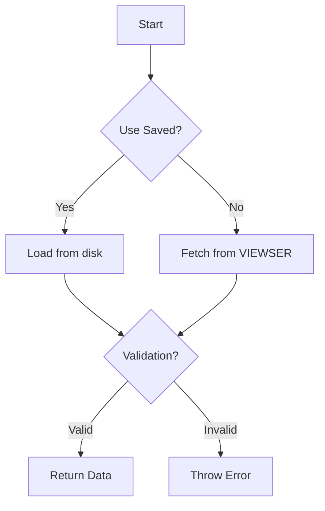

# ViewsDataLoader Class Documentation

## Overview
The `ViewsDataLoader` class handles data loading, validation, and preprocessing for different temporal partitions in a machine learning pipeline. It integrates with VIEWSER data infrastructure, supports partition validation, drift detection, and data persistence features.

## Key Features
- Partition-aware data loading (calibration/validation/forecasting)
- Fresh data fetching vs. cached data loading
- Temporal range validation
- Drift detection integration
- Month override capability
- Data format enforcement

## Class Structure

### Initialization
```python
def __init__(self, model_path: ModelPathManager, **kwargs):
```

| Parameter  | Type              | Description                                      |
|------------|-------------------|--------------------------------------------------|
| model_path | ModelPathManager  | Manages model-specific paths                     |
| **kwargs   | Any               | Additional attributes (partition, override_month, etc.) |

- Initializes paths and configuration:
  - Sets raw/processed data paths from `ModelPathManager`
  - Accepts optional partition configuration through `kwargs`
  - Configures drift detection settings
 
### Core Methods

1. **Partition Configuration**
```python
def _get_partition_dict(self, step=36) -> Dict
```

Defines temporal ranges for different partition types:

| Partition   | Train Range  | Test Range    | Description                      |
|-------------|--------------|---------------|----------------------------------|
| Calibration | (121, 396)   | (397, 444)    | Historical training + validation |
| Validation  | (121, 444)   | (445, 492)    | Extended training + test         |
| Forecasting | (121, N-2)   | (N-1, N+step) | Rolling window forecasting       |

2. **Data Fetching**
```python
def _fetch_data_from_viewser(self, self_test: bool) -> tuple[pd.DataFrame, list]
```
- Fetches data from VIEWSER with drift detection:
  - Retrieves queryset configuration
  - Executes fetch with drift checks
  - Enforces `float64` data types
  - Logs data quality alerts

3. **Temporal Validation**
```python
def _validate_df_partition(self, df: pd.DataFrame) -> bool
```
- Validates DataFrame contains expected months:
  - Checks `month_id` column/index
  - Compares against partition specifications
  - Handles `override_month` for forecasting
 
4. **Main Data Loading**
```python
def get_data(self, self_test: bool, partition: str, 
            use_saved: bool, validate=True, 
            override_month=None) -> tuple[pd.DataFrame, list]
```

**Data loading workflow**:


### Example Use Cases

1. **Basic Calibration Load**
```python
loader = ViewsDataLoader(model_path)
df, alerts = loader.get_data(
    self_test=False,
    partition="calibration",
    use_saved=True
)
```
- Loads pre-cached calibration data
- Skips drift detection
- Automatic temporal validation

2. **Fresh Forecasting Data Fetch**
```python
loader = ViewsDataLoader(model_path, override_month=492)
df, alerts = loader.get_data(
    self_test=True,
    partition="forecasting",
    use_saved=False
)
```
- Fetches fresh data up to month 492
- Performs drift self-test
- Generates new data cache file

3. **Validation with Custom Range**
```pythonloader = ViewsDataLoader(model_path, override_month=500)
df, alerts = loader.get_data(
    self_test=False,
    partition="validation",
    use_saved=False,
    validate=False
)
```
- Overrides default validation range
- Disables automatic validation
- Bypasses data caching

### Error Handling

**The class raises specific exceptions for common failure scenarios**:
| Error Type   | Trigger Condition       | Resolution                              |
|--------------|-------------------------|-----------------------------------------|
| RuntimeError | Missing queryset        | Check model configuration               |
| ValueError   | Invalid partition       | Use calibration/validation/forecasting  |
| RuntimeError | Invalid cached data     | Delete/refresh cache files              |

