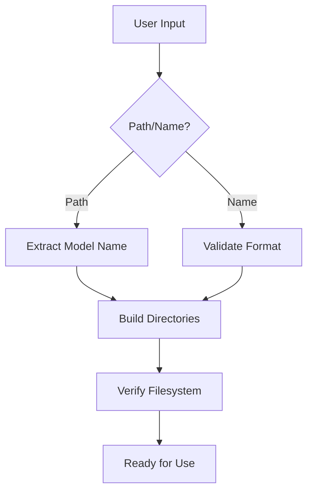

# ModelPathManager and ModelManager Documentation

## Overview
This documentation covers two core classes for managing machine learning workflows in the ViEWS pipeline:
1. **ModelPathManager**: Handles file system operations and path management
2. **ModelManager**: Manages model lifecycle operations and WandB integration

---

## ModelPathManager Class

### Key Responsibilities
- Path resolution and directory creation
- Model name validation
- Artifact management
- Configuration loading
- Filesystem integrity checks

### Core Methods

#### Initialization
```python
def __init__(self, model_path: Union[str, Path], validate: bool = True)
```

| Parameter  | Description                   |
|------------|-------------------------------|
| model_path | Model name or existing path   |
| validate   | Enable filesystem checks      |

### Example:

```python
mpm = ModelPathManager("model_name")
```

### Directory Management

```python
def _initialize_directories(self) -> None
```

Creates standard directory structure:

```
models/
  └─ {model_name}/
      ├─ artifacts/
      ├─ configs/
      ├─ data/
      │   ├─ raw/
      │   ├─ processed/
      │   └─ generated/
      └─ reports/
```

### Artifact Handling

```python
def get_latest_model_artifact_path(self, run_type: str) -> Path
```

Retrieves newest artifact for a run type:

```python
latest_calib = mpm.get_latest_model_artifact_path("calibration")
```

### Validation Methods

```python
@staticmethod
def validate_model_name(name: str) -> bool
```

Ensures names follow adjective_noun format:

```python
valid = ModelPathManager.validate_model_name("orange_pasta")  # True
```

### Example Use Cases

1. New Model Setup

```python
mpm = ModelPathManager("orange_pasta")
mpm.view_directories()
# Outputs directory structure verification
```

2. Artifact Retrieval

```python
forecast_artifact = mpm.get_latest_model_artifact_path("forecasting")
```

### ModelManager Class

#### Key Responsibilities
- End-to-end model lifecycle management
- WandB integration for experiment tracking
- Metrics calculation and logging
- Prediction validation/storage
- Hyperparameter sweeping

#### Core Methods

##### Training Execution

```python
def execute_single_run(self, args) -> None
```

Handles complete training pipeline:
- Data loading
- Model training
- Evaluation
- Artifact storage

##### Sweep Management

```python
def execute_sweep_run(self, args) -> None
```

Orchestrates hyperparameter optimization:

```python
manager.execute_sweep_run(argparse.Namespace(
    run_type="calibration",
    eval_type="standard",
    sweep=True
))
```

### Prediction Handling

```python
def _save_predictions(self, df_predictions, path_generated)
```

Saves forecasts with versioning:

```python
self._save_predictions(forecast_df, Path("results/[runtype_timestamp]"))
```

### Example Use Cases

1. Standard Training Run

```python
args = argparse.Namespace(
    run_type="calibration",
    train=True,
    evaluate=True,
    eval_type="complete"
)
manager = ModelManager(mpm)
manager.execute_single_run(args)
```

2. Production Forecasting

```python
forecast_args = argparse.Namespace(
    run_type="forecasting",
    forecast=True,
    artifact_name="calibration_model_20240315.pt"
)
manager.execute_single_run(forecast_args)
```

3. Metrics Analysis

```python
eval_df = manager._evaluate_prediction_dataframe(predictions)
wandb.log({"metrics": eval_df})
```

### Design Rationale

#### ModelPathManager Structure



#### Key Architecture Decisions

- **Strict Naming Conventions**
  - Ensures project consistency
  - Enables automated artifact discovery
  - Prevents filesystem collisions

- **WandB Integration**
  - Centralized experiment tracking
  - Enables result comparison
  - Supports distributed training

- **Validation Pipeline**
  - Prevents invalid predictions
  - Ensures data compatibility
  - Maintains evaluation integrity

- **Modular Configuration**
  - Separation of hyperparameters/metadata
  - Easy sweep configuration
  - Environment-specific deployment setting

### Error Handling

#### Common Validation Checks

| Check Type           | Method                          | Purpose                        |
|----------------------|---------------------------------|--------------------------------|
| Name Format          | `validate_model_name()`         | Enforce naming conventions     |
| Directory Exists     | `_check_if_dir_exists()`        | Prevent path errors            |
| Artifact Integrity   | `get_latest_model_artifact_path()` | Ensure model compatibility     |
| Prediction Structure | `_validate_prediction_dataframe()` | Maintain output consistency    |

#### Alert System

```python
def _wandb_alert(title: str, text: str, level: AlertLevel)
```

- Real-time monitoring
- Multi-level severity (INFO/WARN/ERROR)
- Integrated with pipeline stages

### Abstract Methods Implementation

Subclasses must implement these core methods:

```python
class CustomModelManager(ModelManager):
    
    def _train_model_artifact(self) -> Any:
        """Custom training logic"""
        pass
    
    def _evaluate_model_artifact(self) -> pd.DataFrame:
        """Custom evaluation logic"""
        pass
    
    def _forecast_model_artifact(self) -> pd.DataFrame:
        """Custom forecasting logic"""
        pass
```
