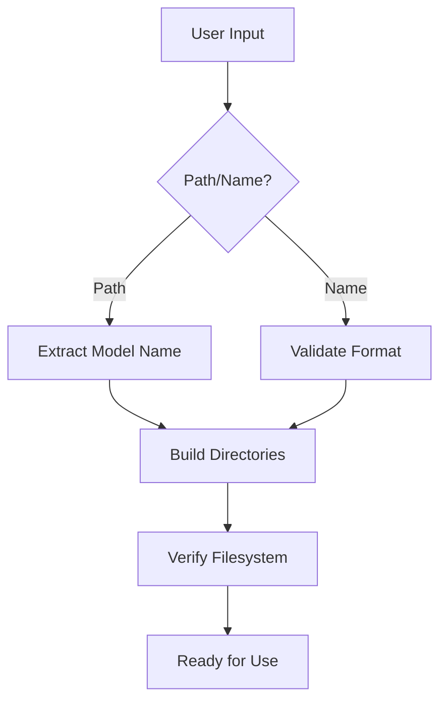
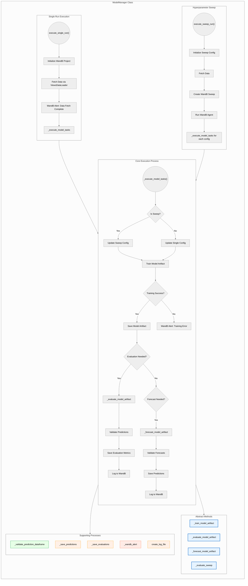

# ModelPathManager and ModelManager Documentation

## Overview
This documentation covers two core classes for managing machine learning workflows in the ViEWS pipeline:
1. **ModelPathManager**: Handles file system operations and path management
2. **ModelManager**: Manages model lifecycle operations and WandB integration

---

## ModelPathManager Class

### Key Responsibilities
- Path resolution and directory creation
- Model name validation
- Artifact management
- Configuration loading
- Filesystem integrity checks

### Core Methods

#### Initialization
```python
def __init__(self, model_path: Union[str, Path], validate: bool = True)
```

| Parameter  | Description                   |
|------------|-------------------------------|
| model_path | Model name or existing path   |
| validate   | Enable filesystem checks      |

### Example:

```python
mpm = ModelPathManager("model_name")
```

### Directory Management

```python
def _initialize_directories(self) -> None
```

Creates standard directory structure:

```
models/
  └─ {model_name}/
      ├─ artifacts/
      ├─ configs/
      ├─ data/
      │   ├─ raw/
      │   ├─ processed/
      │   └─ generated/
      └─ reports/
```

### Artifact Handling

```python
def get_latest_model_artifact_path(self, run_type: str) -> Path
```

Retrieves newest artifact for a run type:

```python
latest_calib = mpm.get_latest_model_artifact_path("calibration")
```

### Validation Methods

```python
@staticmethod
def validate_model_name(name: str) -> bool
```

Ensures names follow adjective_noun format:

```python
valid = ModelPathManager.validate_model_name("orange_pasta")  # True
```

### Example Use Cases

1. New Model Setup

```python
mpm = ModelPathManager("orange_pasta")
mpm.view_directories()
# Outputs directory structure verification
```

2. Artifact Retrieval

```python
forecast_artifact = mpm.get_latest_model_artifact_path("forecasting")
```

#### ModelPathManager Structure



## ModelManager Class

#### Key Responsibilities
- End-to-end model lifecycle management
- WandB integration for experiment tracking
- Metrics calculation and logging
- Prediction validation/storage
- Hyperparameter sweeping

#### Core Methods

##### Training Execution

```python
def execute_single_run(self, args) -> None
```

Handles complete training pipeline:
- Data loading
- Model training
- Evaluation
- Artifact storage

##### Sweep Management

```python
def execute_sweep_run(self, args) -> None
```

Orchestrates hyperparameter optimization:

```python
manager.execute_sweep_run(argparse.Namespace(
    run_type="calibration",
    eval_type="standard",
    sweep=True
))
```

### Prediction Handling

```python
def _save_predictions(self, df_predictions, path_generated)
```

Saves forecasts with versioning:

```python
self._save_predictions(forecast_df, Path("results/[runtype_timestamp]"))
```

### Example Use Cases

1. Standard Training Run

```python
args = argparse.Namespace(
    run_type="calibration",
    train=True,
    evaluate=True,
    eval_type="complete"
)
manager = ModelManager(mpm)
manager.execute_single_run(args)
```

2. Production Forecasting

```python
forecast_args = argparse.Namespace(
    run_type="forecasting",
    forecast=True,
    artifact_name="calibration_model_20240315.pt"
)
manager.execute_single_run(forecast_args)
```

3. Metrics Analysis

```python
eval_df = manager._evaluate_prediction_dataframe(predictions)
wandb.log({"metrics": eval_df})
```

#### Execution Graph



### Design Rationale

#### Key Architecture Decisions

- **Strict Naming Conventions**
  - Ensures project consistency
  - Enables automated artifact discovery
  - Prevents filesystem collisions

- **WandB Integration**
  - Centralized experiment tracking
  - Enables result comparison
  - Supports distributed training

- **Validation Pipeline**
  - Prevents invalid predictions
  - Ensures data compatibility
  - Maintains evaluation integrity

- **Modular Configuration**
  - Separation of hyperparameters/metadata
  - Easy sweep configuration
  - Environment-specific deployment setting

### Error Handling

#### Common Validation Checks

| Check Type           | Method                          | Purpose                        |
|----------------------|---------------------------------|--------------------------------|
| Name Format          | `validate_model_name()`         | Enforce naming conventions     |
| Directory Exists     | `_check_if_dir_exists()`        | Prevent path errors            |
| Artifact Integrity   | `get_latest_model_artifact_path()` | Ensure model compatibility     |
| Prediction Structure | `_validate_prediction_dataframe()` | Maintain output consistency    |

#### Alert System

```python
def _wandb_alert(title: str, text: str, level: AlertLevel)
```

- Real-time monitoring
- Multi-level severity (INFO/WARN/ERROR)
- Integrated with pipeline stages

### Abstract Methods Implementation

Subclasses must implement these core methods:

```python
class CustomModelManager(ModelManager):
    
    def _train_model_artifact(self) -> Any:
        """Custom training logic"""
        pass
    
    def _evaluate_model_artifact(self) -> pd.DataFrame:
        """Custom evaluation logic"""
        pass
    
    def _forecast_model_artifact(self) -> pd.DataFrame:
        """Custom forecasting logic"""
        pass
```

## Dataframe Structures for Evaluation and Forecast Methods

#### Overview
The `_evaluate_model_artifact()` and `_forecast_model_artifact()` methods in the `ModelManager` class must return pandas DataFrames with specific structural requirements. These requirements ensure compatibility with downstream evaluation routines, visualization tools, and ensemble aggregation methods. When making probabilistic predictions with uncertainty estimates, the prediction columns must contain lists/arrays of sample values.

### 1. Index Structure

All dataframes must use a MultiIndex with the following specifications:

#### 1.1 Priogrid-Month (PGM) Format

**Index Levels (in order):**
- `month_id` (int) - Temporal index
- `priogrid_id` (int) - Spatial index

**Example:**
```python
MultiIndex([(500, 100001),
            (500, 100002),
            (501, 100001)],
           names=['month_id', 'priogrid_id'])
```

#### 1.2 Country-Month (CM) Format

**Index Levels (in order):**
- `month_id` (int) - Temporal index
- `country_id` (int) - Spatial index

**Example:**
```python
MultiIndex([(500, 4),
            (500, 6),
            (501, 4)],
           names=['month_id', 'country_id'])
```

### 2. Column Requirements

#### 2.1 Evaluation DataFrames

Must contain **a list prediction dataframes**. The list is of the same length as the number of sequences:

| Column Pattern       | Data Type       | Description                      |
|----------------------|-----------------|----------------------------------|
| `pred_{depvar}`      | list/np.ndarray | Prediction samples (N samples)   |

**Example Structure:**
```python
                     pred_ln_sb_best
month_id priogrid_id                             
500      100001      [0.48, 0.49, ...]
         100002      [0.01, 0.00, ...]
501      100001      [1.10, 1.15, ...]
```

#### 2.2 Forecast DataFrames

Contains only prediction columns:

| Column Pattern       | Data Type       | Description                    |
|----------------------|-----------------|--------------------------------|
| `pred_{depvar}`      | list/np.ndarray | Prediction samples (N samples) |

**Example Structure:**
```python
                     pred_ln_ns_best
month_id country_id                             
502      4           [0.31, 0.29, ..., 0.33]
         6           [0.05, 0.07, ..., 0.04]
503      4           [0.28, 0.30, ..., 0.29]
```

### 3. Uncertainty Representation

When making probabilistic predictions:

**Required Format:**
- Prediction columns must contain list-like objects of sample values
- All prediction columns must contain the same number of samples
- Samples must be numeric (int or float)

**Example with 1000 Samples:**
```python
# PGM Example
df_eval['pred_ln_sb_best'] = df_eval['pred_ln_sb_best'].apply(
    lambda: list(np.random.normal(0, 1, 1000))
    
# CM Example  
df_forecast['pred_ln_os_best'] = df_forecast['pred_ln_os_best'].apply(
    lambda: np.random.beta(2, 5, 1000))
```

### 4. Validation Checks

The `_validate_prediction_dataframe()` method enforces:

**Structural Validation:**
- Correct MultiIndex levels and names
- Presence of required `pred_*` columns
- Consistent sample sizes across prediction columns

**Value Validation:**
- Non-empty prediction arrays
- Numeric sample values
- No NaN values in predictions (unless explicitly allowed)

### 5. Full Examples

#### 5.1 PGM Evaluation Output
```python
import numpy as np
import pandas as pd

index = pd.MultiIndex.from_tuples(
    [(500, 100001), (500, 100002), (501, 100001)],
    names=['month_id', 'priogrid_id']
)

data = {
    'ln_sb_best': [0.512, 0.000, 1.204],
    'pred_ln_sb_best': [
        np.random.normal(0.5, 0.1, 1000),
        np.random.normal(0.0, 0.05, 1000), 
        np.random.normal(1.2, 0.15, 1000)
    ]
}

df_eval = pd.DataFrame(data, index=index)
```

#### 5.1 CM Forecast Output
```python
index = pd.MultiIndex.from_tuples(
    [(502, 4), (502, 6), (503, 4)],
    names=['month_id', 'country_id']
)

data = {
    'pred_ln_ns_best': [
        np.random.beta(2, 5, 1000),
        np.random.beta(1, 10, 1000),
        np.random.beta(3, 3, 1000)
    ]
}
df_forecast = pd.DataFrame(data, index=index)
```

This structure ensures compatibility with the VIEWS evaluation framework while allowing efficient storage and processing of both point estimates and probabilistic predictions.

