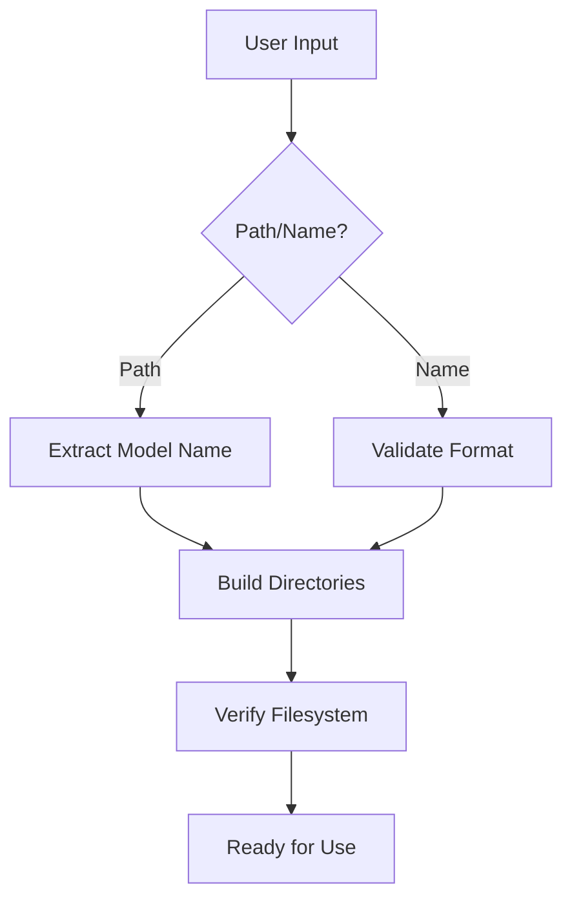
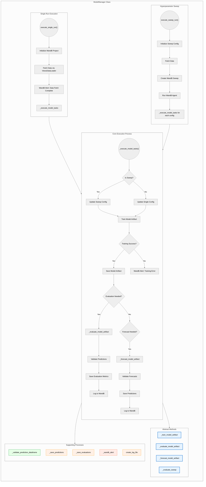
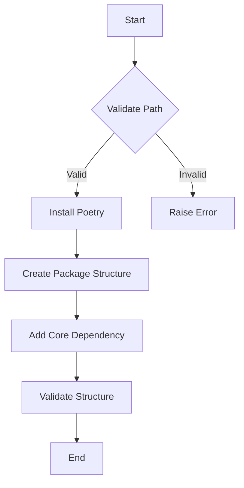

# Table of Contents

- [ModelPathManager and ModelManager Documentation](#modelpathmanager-and-modelmanager-documentation)
  - [ModelPathManager Class](#modelpathmanager-class)
    - [Key Responsibilities](#key-responsibilities)
    - [Core Methods](#core-methods)
      - [Initialization](#initialization)
      - [Directory Management](#directory-management)
      - [Artifact Handling](#artifact-handling)
      - [Validation Methods](#validation-methods)
    - [Example Use Cases](#example-use-cases)
    - [ModelPathManager Structure](#modelpathmanager-structure)
  - [ModelManager Class](#modelmanager-class)
    - [Key Responsibilities](#key-responsibilities-1)
    - [Core Methods](#core-methods-1)
      - [Training Execution](#training-execution)
      - [Sweep Management](#sweep-management)
      - [Prediction Handling](#prediction-handling)
    - [Example Use Cases](#example-use-cases-1)
    - [Execution Graph](#execution-graph)
  - [Design Rationale](#design-rationale)
    - [Key Architecture Decisions](#key-architecture-decisions)
  - [Error Handling](#error-handling)
    - [Common Validation Checks](#common-validation-checks)
    - [Alert System](#alert-system)
  - [Abstract Methods Implementation](#abstract-methods-implementation)
- [Dataframe Structures for Evaluation and Forecast Methods](#dataframe-structures-for-evaluation-and-forecast-methods)
  - [Index Structure](#index-structure)
  - [Column Requirements](#column-requirements)
  - [Uncertainty Representation](#uncertainty-representation)
  - [Validation Checks](#validation-checks)
  - [Full Examples](#full-examples)
- [LoggingManager Documentation](#loggingmanager-documentation)
  - [Overview](#overview)
  - [Features](#features)
  - [Class Definition](#class-definition)
    - [Attributes](#attributes)
    - [Methods](#methods)
- [MappingManager Documentation](#mappingmanager-documentation)
  - [Overview](#overview-1)
  - [Class Initialization](#class-initialization)
  - [Key Methods](#key-methods)
  - [Full Workflow Examples](#full-workflow-examples)
  - [Key Features](#key-features)
- [PackageManager Documentation](#packagemanager-documentation)
  - [Overview](#overview-2)
  - [Class Architecture](#class-architecture)
  - [Initialization](#initialization-1)
  - [Core Methods](#core-methods-2)
  - [Troubleshooting Guide](#troubleshooting-guide)

# ModelPathManager and ModelManager Documentation

## Overview
This documentation covers two core classes for managing machine learning workflows in the ViEWS pipeline:
1. **ModelPathManager**: Handles file system operations and path management
2. **ModelManager**: Manages model lifecycle operations and WandB integration

---

## ModelPathManager Class

### Key Responsibilities
- Path resolution and directory creation
- Model name validation
- Artifact management
- Configuration loading
- Filesystem integrity checks

### Core Methods

#### Initialization
```python
def __init__(self, model_path: Union[str, Path], validate: bool = True)
```

| Parameter  | Description                   |
|------------|-------------------------------|
| model_path | Model name or existing path   |
| validate   | Enable filesystem checks      |

### Example:

```python
mpm = ModelPathManager("model_name")
```

### Directory Management

```python
def _initialize_directories(self) -> None
```

Creates standard directory structure:

```
models/
  └─ {model_name}/
      ├─ artifacts/
      ├─ configs/
      ├─ data/
      │   ├─ raw/
      │   ├─ processed/
      │   └─ generated/
      └─ reports/
```

### Artifact Handling

```python
def get_latest_model_artifact_path(self, run_type: str) -> Path
```

Retrieves newest artifact for a run type:

```python
latest_calib = mpm.get_latest_model_artifact_path("calibration")
```

### Validation Methods

```python
@staticmethod
def validate_model_name(name: str) -> bool
```

Ensures names follow adjective_noun format:

```python
valid = ModelPathManager.validate_model_name("orange_pasta")  # True
```

### Example Use Cases

1. New Model Setup

```python
mpm = ModelPathManager("orange_pasta")
mpm.view_directories()
# Outputs directory structure verification
```

2. Artifact Retrieval

```python
forecast_artifact = mpm.get_latest_model_artifact_path("forecasting")
```

#### ModelPathManager Structure



## ModelManager Class

#### Key Responsibilities
- End-to-end model lifecycle management
- WandB integration for experiment tracking
- Metrics calculation and logging
- Prediction validation/storage
- Hyperparameter sweeping

#### Core Methods

##### Training Execution

```python
def execute_single_run(self, args) -> None
```

Handles complete training pipeline:
- Data loading
- Model training
- Evaluation
- Artifact storage

##### Sweep Management

```python
def execute_sweep_run(self, args) -> None
```

Orchestrates hyperparameter optimization:

```python
manager.execute_sweep_run(argparse.Namespace(
    run_type="calibration",
    eval_type="standard",
    sweep=True
))
```

### Prediction Handling

```python
def _save_predictions(self, df_predictions, path_generated)
```

Saves forecasts with versioning:

```python
self._save_predictions(forecast_df, Path("orange_pasta/data/generated/predictions_forecasting_20250218_132543.parquet"))
```

### Example Use Cases

1. Standard Training Run

```python
args = argparse.Namespace(
    run_type="calibration",
    train=True,
    evaluate=True,
    eval_type="complete"
)
manager = ModelManager(mpm)
manager.execute_single_run(args)
```

2. Production Forecasting

```python
forecast_args = argparse.Namespace(
    run_type="forecasting",
    forecast=True,
    artifact_name="calibration_model_20240315.pt"
)
manager.execute_single_run(forecast_args)
```

3. Metrics Analysis

```python
eval_df = manager._evaluate_prediction_dataframe(predictions)
wandb.log({"metrics": eval_df})
```

#### Execution Graph



### Design Rationale

#### Key Architecture Decisions

- **Strict Naming Conventions**
  - Ensures project consistency
  - Enables automated artifact discovery
  - Prevents filesystem collisions

- **WandB Integration**
  - Centralized experiment tracking
  - Enables result comparison
  - Supports distributed training

- **Validation Pipeline**
  - Prevents invalid predictions
  - Ensures data compatibility
  - Maintains evaluation integrity

- **Modular Configuration**
  - Separation of hyperparameters/metadata
  - Easy sweep configuration
  - Environment-specific deployment setting

### Error Handling

#### Common Validation Checks

| Check Type           | Method                          | Purpose                        |
|----------------------|---------------------------------|--------------------------------|
| Name Format          | `validate_model_name()`         | Enforce naming conventions     |
| Directory Exists     | `_check_if_dir_exists()`        | Prevent path errors            |
| Artifact Integrity   | `get_latest_model_artifact_path()` | Ensure model compatibility     |
| Prediction Structure | `_validate_prediction_dataframe()` | Maintain output consistency    |

#### Alert System

```python
def _wandb_alert(title: str, text: str, level: AlertLevel)
```

- Real-time monitoring
- Multi-level severity (INFO/WARN/ERROR)
- Integrated with pipeline stages

### Abstract Methods Implementation

Subclasses must implement these core methods:

```python
class CustomModelManager(ModelManager):
    
    def _train_model_artifact(self) -> Any:
        """Custom training logic"""
        pass
    
    def _evaluate_model_artifact(self) -> pd.DataFrame:
        """Custom evaluation logic"""
        pass
    
    def _forecast_model_artifact(self) -> pd.DataFrame:
        """Custom forecasting logic"""
        pass
```

## Dataframe Structures for Evaluation and Forecast Methods

#### Overview
The `_evaluate_model_artifact()` and `_forecast_model_artifact()` methods in the `ModelManager` class must return pandas DataFrames with specific structural requirements. These requirements ensure compatibility with downstream evaluation routines, visualization tools, and ensemble aggregation methods. When making probabilistic predictions with uncertainty estimates, the prediction columns must contain lists/arrays of sample values.

### 1. Index Structure

All dataframes must use a MultiIndex with the following specifications:

#### 1.1 Priogrid-Month (PGM) Format

**Index Levels (in order):**
- `month_id` (int) - Temporal index
- `priogrid_id` (int) - Spatial index

**Example:**
```python
MultiIndex([(500, 100001),
            (500, 100002),
            (501, 100001)],
           names=['month_id', 'priogrid_id'])
```

#### 1.2 Country-Month (CM) Format

**Index Levels (in order):**
- `month_id` (int) - Temporal index
- `country_id` (int) - Spatial index

**Example:**
```python
MultiIndex([(500, 4),
            (500, 6),
            (501, 4)],
           names=['month_id', 'country_id'])
```

### 2. Column Requirements

#### 2.1 Evaluation DataFrames

Must contain **a list prediction dataframes**. The list is of the same length as the number of sequences:

| Column Pattern       | Data Type       | Description                      |
|----------------------|-----------------|----------------------------------|
| `pred_{target}`      | list/np.ndarray/float | Prediction samples (N samples)   |

**Example Structures:**
```python
                     pred_ln_sb_best
month_id priogrid_id                             
500      100001      [0.48, 0.49, ...]
         100002      [0.01, 0.00, ...]
501      100001      [1.10, 1.15, ...]
```

```python
                     pred_ln_sb_best
month_id priogrid_id                             
500      100001      0.49
         100002      0.00
501      100001      1.15
```

#### 2.2 Forecast DataFrames

Contains only prediction columns:

| Column Pattern       | Data Type       | Description                    |
|----------------------|-----------------|--------------------------------|
| `pred_{target}`      | list/np.ndarray/float | Prediction samples (N samples) |

**Example Structures:**
```python
                     pred_ln_ns_best
month_id country_id                             
502      4           [0.31, 0.29, ..., 0.33]
         6           [0.05, 0.07, ..., 0.04]
503      4           [0.28, 0.30, ..., 0.29]
```

```python
                     pred_ln_ns_best
month_id country_id                             
502      4           0.29
         6           0.07
503      4           0.30
```

### 3. Uncertainty Representation

When making probabilistic predictions:

**Required Format:**
- Prediction columns must contain list-like objects of sample values
- All prediction columns must contain the same number of samples
- Samples must be numeric (int or float)

**Example with 1000 Samples:**
```python
# PGM Example
df_eval['pred_ln_sb_best'] = df_eval['pred_ln_sb_best'].apply(
    lambda: list(np.random.normal(0, 1, 1000))
    
# CM Example  
df_forecast['pred_ln_os_best'] = df_forecast['pred_ln_os_best'].apply(
    lambda: np.random.beta(2, 5, 1000))
```

### 4. Validation Checks

The `_validate_prediction_dataframe()` method enforces:

**Structural Validation:**
- Correct MultiIndex levels and names
- Presence of required `pred_*` columns
- Consistent sample sizes across prediction columns

**Value Validation:**
- Non-empty prediction arrays
- Numeric sample values
- No NaN values in predictions (unless explicitly allowed)

### 5. Full Examples

#### 5.1 PGM Evaluation Output
```python
import numpy as np
import pandas as pd

index = pd.MultiIndex.from_tuples(
    [(500, 100001), (500, 100002), (501, 100001)],
    names=['month_id', 'priogrid_id']
)

sequence_length = 12

data = {
    'pred_ln_sb_best': [
        np.random.normal(0.5, 0.1, 1000),
        np.random.normal(0.0, 0.05, 1000), 
        np.random.normal(1.2, 0.15, 1000)
    ]
}

df_eval = [pd.DataFrame(data, index=index)] * sequence_length
```

#### 5.1 CM Forecast Output
```python
index = pd.MultiIndex.from_tuples(
    [(502, 4), (502, 6), (503, 4)],
    names=['month_id', 'country_id']
)

data = {
    'pred_ln_ns_best': [
        np.random.beta(2, 5, 1000),
        np.random.beta(1, 10, 1000),
        np.random.beta(3, 3, 1000)
    ]
}
df_forecast = pd.DataFrame(data, index=index)
```

This structure ensures compatibility with the VIEWS evaluation framework while allowing efficient storage and processing of both point estimates and probabilistic predictions.

# LoggingManager Documentation

## Overview
The `LoggingManager` class provides a centralized logging solution for machine learning pipelines. It handles:
- Custom logging configuration via YAML
- Dynamic log path management
- Error handling and fallback configurations

## Features
- **YAML-based Configuration** - External logging configuration
- **Automatic Directory Creation** - Ensures log directories exist
- **Multiple Handlers** - Supports simultaneous file and console logging
- **Environment Awareness** - Handles different execution contexts
- **Error Resilience** - Fallback to basic logging on configuration failures

## Class Definition

### Attributes
| Attribute | Type | Description |
|-----------|------|-------------|
| `model_path` | `ModelPathManager` | Manages pipeline directory structure |
| `_default_level` | `int` | Fallback logging level (default: INFO) |
| `_logging_is_active` | `bool` | Master switch for logging system |
| `_logging_path` | `Path` | Calculated path for log storage |
| `_logger` | `logging.Logger` | Central logger instance |

### Methods
```python
def __init__(self, model_path: ModelPathManager)
def get_logger(self) -> logging.Logger
```

# MappingManager Documentation

## Overview
The `MappingManager` class provides geospatial visualization capabilities for VIEWS datasets (both country-month and priogrid-month formats). It handles:
- Shapefile integration
- Geometry validation
- Interactive and static map generation
- Dataset subset selection

## Class Initialization

```python
def __init__(self, views_dataset: Union[PGMDataset, CMDataset])
```

### Parameters:

`views_dataset`: Initialized dataset object of type `PGMDataset` or `CMDataset`

### Example:

```python
from views_pipeline_core.data.handlers import CMDataset
from mapping_manager import MappingManager

# Initialize country-month dataset
cm_dataset = CMDataset(...)  
mapper = MappingManager(cm_dataset)
```

### Key Methods

#### 1. `get_subset_mapping_dataframe`

```python
def get_subset_mapping_dataframe(
    self,
    time_ids: Optional[Union[int, List[int]]] = None,
    entity_ids: Optional[Union[int, List[int]]] = None
) -> pd.DataFrame
```

**Parameters:**
- `time_ids`: Single time ID or list of time IDs
- `entity_ids`: Single entity ID or list of entity IDs

**Returns:**
- Subset GeoDataFrame with geometries merged

**Example:**

```python
# Get data for time_id=500 and country_ids [4, 10]
subset_df = mapper.get_subset_mapping_dataframe(
    time_ids=500,
    entity_ids=[4, 10]
)
```

#### 2. `plot_map`

```python
def plot_map(
    self,
    mapping_dataframe: pd.DataFrame,
    target: str,
    interactive: bool = False,
    as_html: bool = False
) -> Union[plt.Figure, str]
```

**Parameters:**
- `mapping_dataframe`: DataFrame from `get_subset_mapping_dataframe`
- `target`: Feature/target variable to visualize
- `interactive`: Generate Plotly map if True
- `as_html`: Return HTML string instead of figure object

**Returns:**
- Matplotlib figure or Plotly figure/HTML string

**Example:**

#### Static matplotlib plot

```python
static_fig = mapper.plot_map(subset_df, "ln_ged_best", interactive=False)
```

#### Interactive Plotly HTML

```python
interactive_html = mapper.plot_map(
    subset_df, 
    "ln_ged_best", 
    interactive=True, 
    as_html=True
)
```

### Full Workflow Examples

#### Country-Month Visualization

```python
# 1. Initialize dataset and manager
cm_dataset = CMDataset(...)
mapper = MappingManager(cm_dataset)

# 2. Get full dataset with geometries
full_cm_df = mapper.get_subset_mapping_dataframe()

# 3. Generate interactive map
fig = mapper.plot_map(full_cm_df, "ln_ged_best", interactive=True)
fig.show()

# 4. Create static image for single month
single_month_df = mapper.get_subset_mapping_dataframe(time_ids=500)
static_fig = mapper.plot_map(single_month_df, "ln_ged_best")
static_fig.savefig("cm_map.png")
```

#### Priogrid-Month Visualization

```python
# 1. Initialize PGM dataset
pgm_dataset = PGMDataset(...)
pgm_mapper = MappingManager(pgm_dataset)

# 2. Get subset for multiple time periods
pgm_subset = pgm_mapper.get_subset_mapping_dataframe(
    time_ids=[500, 501, 502],
    entity_ids=[1200:1300]  # Specific grid cells
)

# 3. Create animated visualization
html_output = pgm_mapper.plot_map(
    pgm_subset,
    "ln_ged_best",
    interactive=True,
    as_html=True
)

# Save HTML output
with open("pgm_interactive.html", "w") as f:
    f.write(html_output)
```

### Key Features

#### Geometry Handling
- Automatically merges statistical data with shapefiles
- Validates geometries with warnings for:
  - Missing geometries
  - Empty geometries
  - Invalid spatial references
- CRS standardization (EPSG:4326 for visualization)

#### Visualization Options

**Static Maps (Matplotlib):**
- Single time period only
- Customizable color scales
- Built-in legend and labels

**Interactive Maps (Plotly):**
- Time slider for temporal animation
- Hover tooltips with metadata
- HTML export capability

# PackageManager Documentation

## Overview
The `PackageManager` class provides comprehensive management of Python Poetry packages within the VIEWS ecosystem, handling:
- Package creation and validation
- Dependency management
- GitHub integration for release tracking
- Organizational naming conventions

## Class Architecture

### Initialization

#### Constructor

```python
def __init__(self, package_path: Union[str, Path], validate: bool = True)
```

**Parameters:**
- `package_path`: Path to existing package or package name for remote operations
- `validate`: Enable path validation (default: True)

**Initialization Modes:**

**Local Package Mode (when path exists):**
- Validates package structure
- Sets up core paths

**Remote Package Mode (when using package name):**
- Validates naming convention
- Fetches latest GitHub release

**Example Initializations:**

```python
# Local package mode
local_pkg = PackageManager(Path("/path/to/views-my-package"))

# Remote package mode
remote_pkg = PackageManager("views-another-package")
```

### Core Methods

#### 1. `create_views_package()`

```python
def create_views_package(self)
```

Creates new Poetry package with VIEWS standards:
- Enforces Python 3.11-3.14 compatibility
- Automatically adds views-pipeline-core dependency
- Creates standard directory structure

**Flow:**



**Example:**

```python
new_pkg = PackageManager(Path("/new/packages/views-new-package"))
new_pkg.create_views_package()
```

#### 2. `add_dependency()`

```python
def add_dependency(self, package_name: str, version: str = None)
```

Manages package dependencies through Poetry:
- Supports exact versions or version ranges
- Handles Poetry installation checks
- Validates package operations

**Example:**

```python
local_pkg.add_dependency("pandas", ">=2.0.0")
local_pkg.add_dependency("numpy")  # Latest version
```

#### 3. `validate_views_package()`

```python
def validate_views_package(self)
```

Performs comprehensive validation:
- Poetry configuration check
- Dependency resolution
- Directory structure validation
- Organizational naming conventions

**Example:**

```python
if local_pkg.validate_views_package():
    print("Package valid for deployment")
```

### Troubleshooting Guide

| Issue                   | Solution                                      |
|-------------------------|-----------------------------------------------|
| Poetry not found        | Run `pip install poetry` manually             |
| Invalid package name    | Follow `views-<projectname>` format           |
| Dependency conflicts    | Use `poetry update` in package directory      |
| Path validation errors  | Check directory permissions and structure     |

