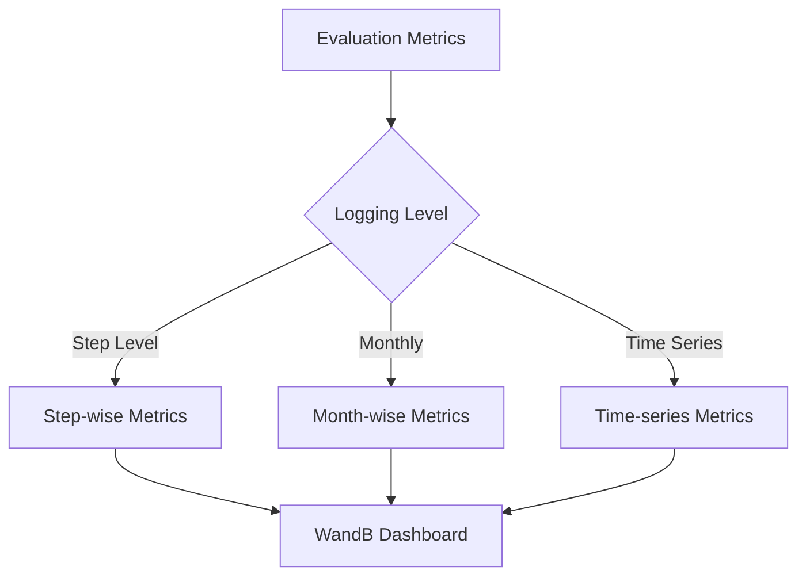
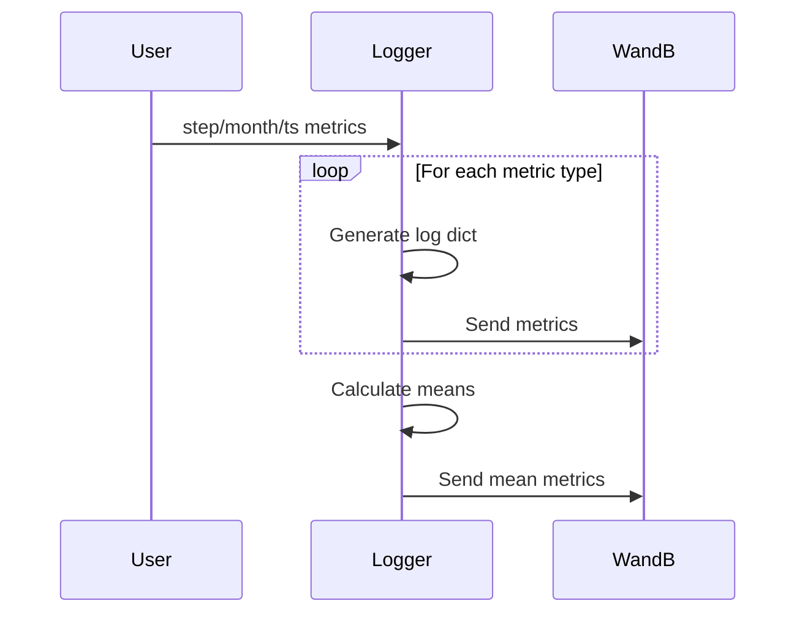

# WandB Evaluation Metrics Logger

## Overview
This module provides utilities for logging structured evaluation metrics to Weights & Biases (WandB) with three distinct granularities:
1. **Step-wise**: Metrics per forecasting step
2. **Month-wise**: Metrics per calendar month
3. **Time-series-wise**: Metrics per individual time series



### Core Functions

#### 1. `add_wandb_metrics()`
**Purpose:** Configures WandB metric relationships

```python
wandb.init(project="my_project")
add_wandb_metrics()
```

**Metric Structure:**

| Metric Type         | Step Metric         | Example Metric          |
|---------------------|---------------------|-------------------------|
| Step-wise           | step-wise/step      | step-wise/mae-sb        |
| Month-wise          | month-wise/month    | month-wise/rmse-os      |
| Time-series-wise    | time-series-wise/ts | time-series-wise/r2-ns  |

#### 2. Metric Generation Functions

**`generate_wandb_step_wise_log_dict()`**

```python
step_metrics = {
    'step01': EvaluationMetrics(mae=0.2, rmse=0.3),
    'step02': EvaluationMetrics(mae=0.18, rmse=0.28)
}

log_dict = generate_wandb_step_wise_log_dict(
    {}, step_metrics, 'step01', 'sb'
)
# Returns {'step-wise/mae-sb': 0.2, 'step-wise/rmse-sb': 0.3}
```

**`generate_wandb_month_wise_log_dict()`**

```python
month_metrics = {
    'month501': EvaluationMetrics(mae=0.25, rmse=0.35),
    'month502': EvaluationMetrics(mae=0.22, rmse=0.32)
}

log_dict = generate_wandb_month_wise_log_dict(
    {}, month_metrics, 'month501', 'os'
)
# Returns {'month-wise/mae-os': 0.25, 'month-wise/rmse-os': 0.35}
```

**`generate_wandb_time_series_wise_log_dict()`**

```python
ts_metrics = {
    'ts01': EvaluationMetrics(mae=0.19, rmse=0.29),
    'ts02': EvaluationMetrics(mae=0.21, rmse=0.31)
}

log_dict = generate_wandb_time_series_wise_log_dict(
    {}, ts_metrics, 'ts01', 'ns'
)
# Returns {'time-series-wise/mae-ns': 0.19, 'time-series-wise/rmse-ns': 0.29}
```

#### 3. `calculate_mean_evaluation_metrics()`
**Purpose:** Computes average metrics across all entries

```python
metrics = {
    'step01': EvaluationMetrics(mae=0.2, rmse=0.3),
    'step02': EvaluationMetrics(mae=0.18, rmse=0.28)
}

mean_metrics = calculate_mean_evaluation_metrics(metrics)
# Returns {'mae': 0.19, 'rmse': 0.29}
```

#### 4. `log_wandb_log_dict()`
**Purpose:** Main logging function


